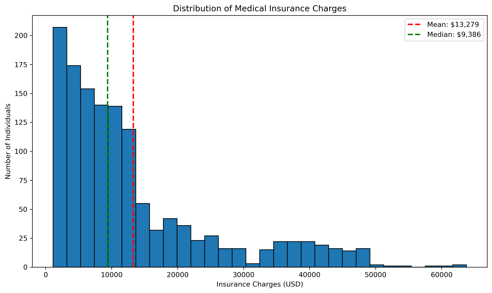
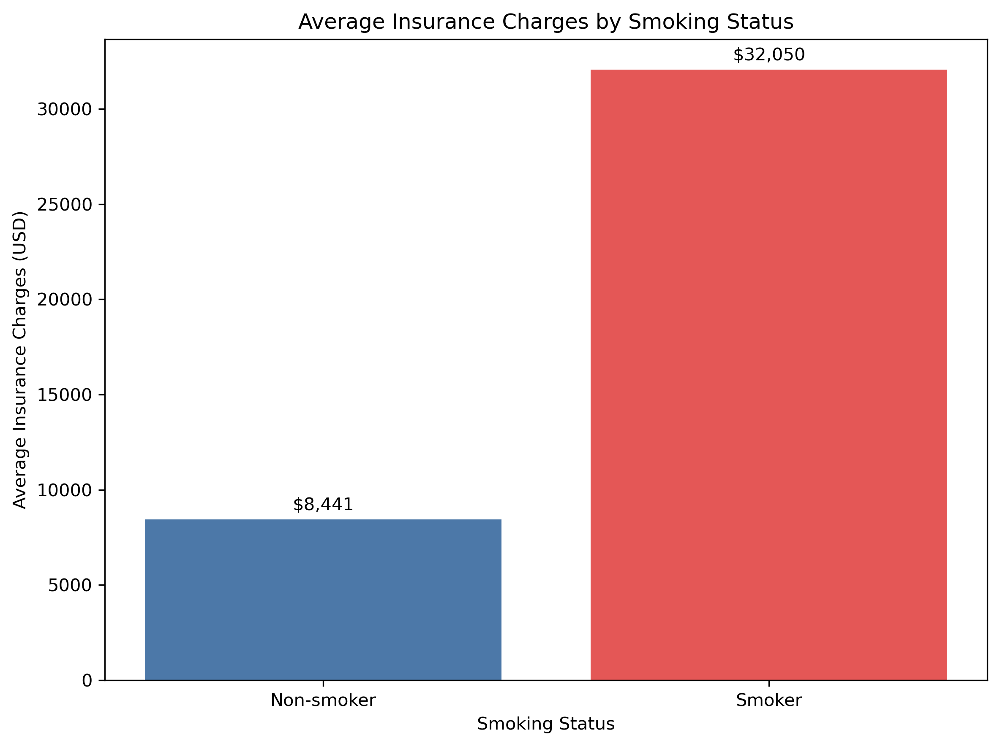
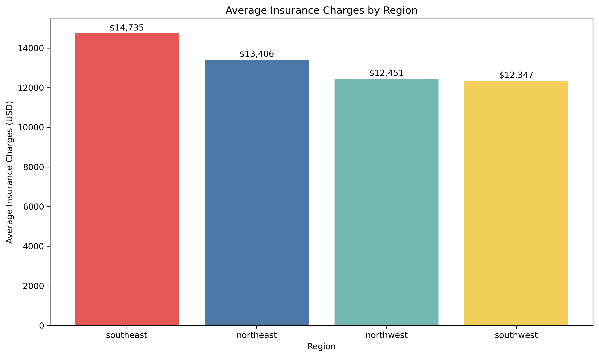
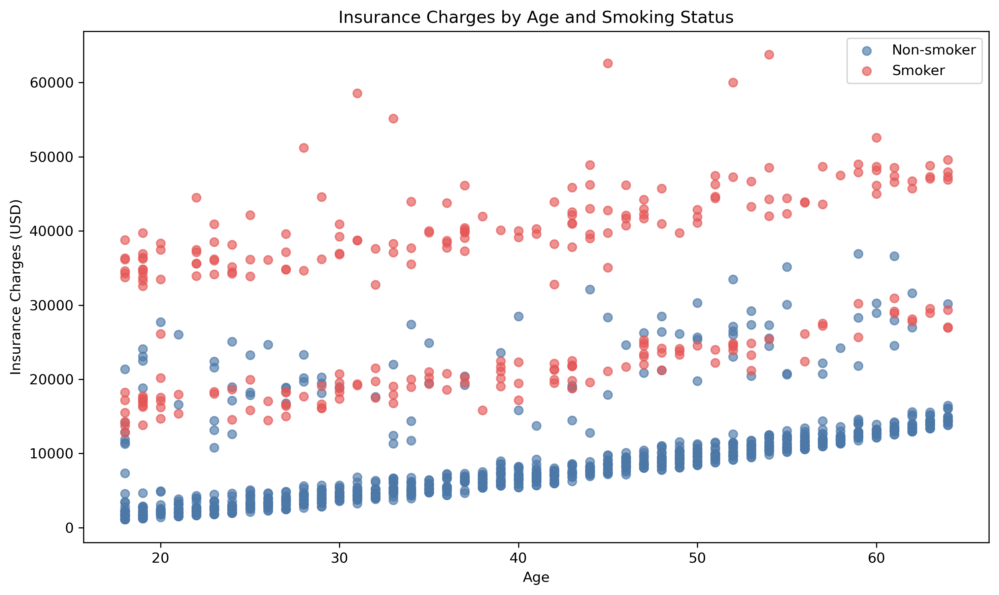
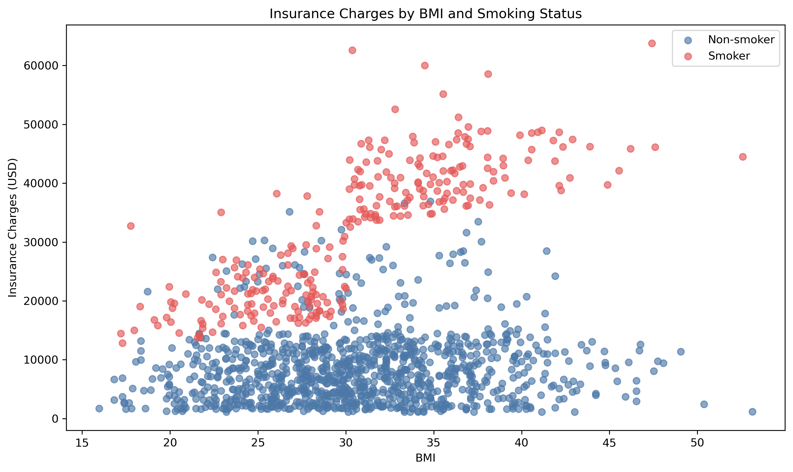
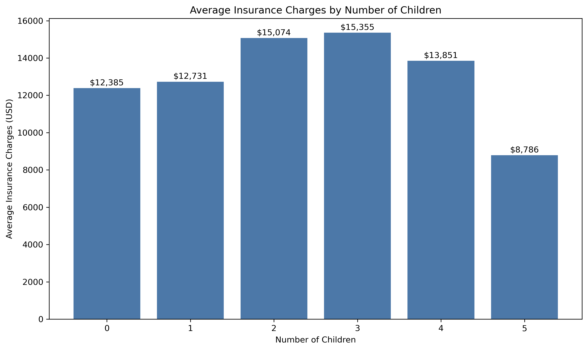

# U.S. Medical Insurance Costs Analysis

## Project Overview

This project explores demographic and health-related factors associated with individual medical insurance charges in the United States.

Using Python, pandas, and Matplotlib, I performed exploratory data analysis on an insurance dataset containing demographic, health, geographic, and insurance-cost information. The analysis focuses on how medical insurance charges vary by smoking status, age, BMI, region, sex, and number of children.

> This is an exploratory analysis of observational data. The findings describe associations in this dataset and do not establish causation.

## Business Questions

This project answers the following questions:

1. What are the average and median insurance charges in the dataset?
2. How do insurance charges differ between smokers and non-smokers?
3. Which U.S. region has the highest and lowest average insurance charges?
4. How are age and BMI associated with insurance charges?
5. Do insurance charges differ based on the number of children?

## Dataset

The dataset contains individual medical insurance records with the following fields:

| Column | Description |
|---|---|
| `age` | Age of the primary insurance beneficiary |
| `sex` | Sex of the insurance beneficiary |
| `bmi` | Body mass index |
| `children` | Number of dependents covered by insurance |
| `smoker` | Smoking status |
| `region` | Residential region in the United States |
| `charges` | Individual medical insurance charges billed by health insurance |

## Data Preparation

The original dataset contained 1,338 records and 7 variables.

Data-quality checks identified:

- No missing values across all columns.
- Consistently formatted categorical values.
- One exact duplicate record.

I removed the duplicate record, resulting in a cleaned dataset containing **1,337 records**. All analysis in the notebook uses the cleaned dataset.

## Tools and Skills

### Tools

- Python 3
- pandas
- Matplotlib
- Jupyter Notebook

### Skills Demonstrated

- Data loading and inspection
- Data-quality validation
- Duplicate-record identification and removal
- Descriptive statistics
- Grouped aggregation with `groupby()`
- Correlation analysis
- Exploratory data analysis
- Data visualization with Matplotlib
- Clear reporting of insights and limitations

## Key Findings

### 1. Insurance charges are strongly right-skewed

The average insurance charge was **$13,279.12**, while the median was **$9,386.16**. Charges ranged from **$1,121.87** to **$63,770.43**, showing that a smaller number of high-cost records increased the overall mean.

### 2. Smoking status has the strongest association with insurance charges

Smokers had an average insurance charge of **$32,050.23**, compared with **$8,440.66** for non-smokers.

- Difference: **$23,609.57**
- Smoker average: approximately **3.8 times** the non-smoker average

### 3. Regional differences are comparatively modest

The Southeast had the highest average insurance charge at **$14,735.41**, while the Southwest had the lowest at **$12,346.94**.

The difference between the highest and lowest regional averages was **$2,388.47**, substantially smaller than the difference between smokers and non-smokers.

### 4. Age shows a moderate positive association with charges

Age and insurance charges had a correlation of **0.298**, indicating that charges generally tended to increase as age increased. Smoking status created visibly different charge patterns across the age range.

### 5. BMI has a weak positive association with charges

BMI and charges had a correlation of **0.198**. The overall association was weaker than the relationships observed for smoking status and age.

### 6. Number of children shows no consistent linear pattern

Average insurance charges increased from approximately **$12,385** for people with no children to **$15,355** for those with three children. However, charges declined in the four- and five-children categories.

Because the four- and five-children groups contain fewer observations, those averages should be interpreted cautiously.

## Limitations

- The dataset is observational, so the analysis identifies associations rather than causation.
- The data contains a limited set of demographic and health-related variables.
- The dataset does not include potentially relevant factors such as health conditions, insurance-plan details, income, location at a more detailed level, or medical-service utilization.
- Small sample sizes in some children categories can make group averages less stable.

## Future Improvements

Potential next steps include:

- Build a regression model to estimate insurance charges.
- Evaluate model performance using MAE, RMSE, and R-squared.
- Investigate interactions between smoking status, BMI, and age.
- Explore high-cost outliers in greater detail.
- Compare multiple regression algorithms and feature-engineering approaches.

## Author

**Domas Semenauskas**  
Aspiring Data Analyst | Python, SQL, Power BI, Snowflake

[GitHub Profile](https://github.com/domas-sem)
